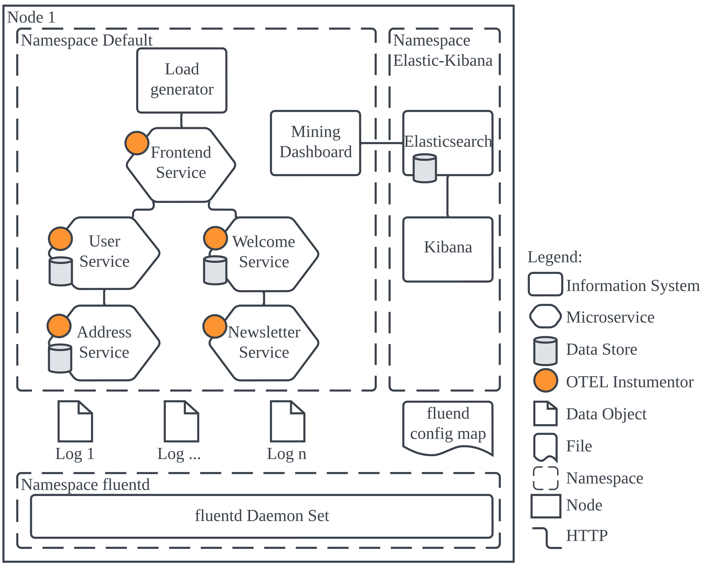
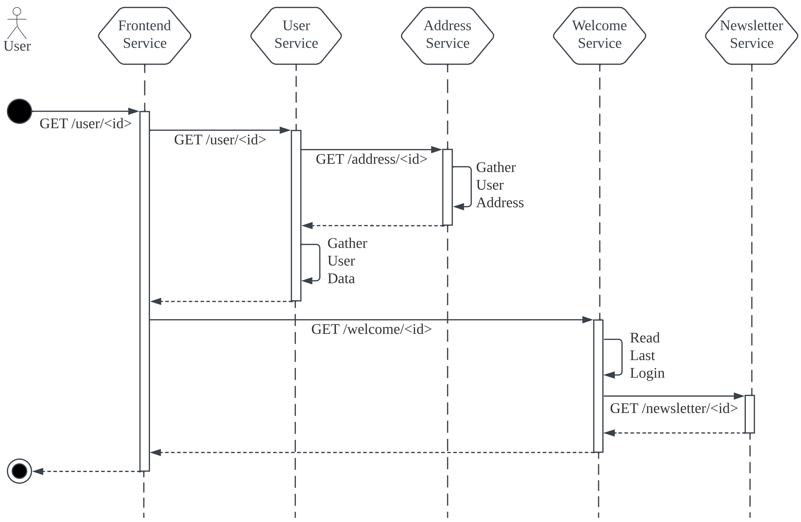

# Transparency Logging Example

## Demo Architecture
### Architecture Overview
The system under survey was implemented in the popular Kubernetes container orchestration system for easy reproducibility.
The entire architecture can be set up in any Kubernetes environment through a simple skaffold run command in the repository. 
The setup is configured to run on the same node for simplicity and illustration reasons. 
However, by modifying the manifest configuration files, it can easily be deployed on different nodes.

The architecture is composed of three namespaces.
The *default* namespace contains all of the bespoke developed information systems and microservices of this contribution C2 as well as the *Mining Dashboard* component of component C3.

All microservices were implemented utilizing the micro web framework Flask, which is written in Python and, due to its simplicity, works best to create prototypes at a fast pace.

The *fluentd* namespace contains the log collection component Fluentd whereas the *Elastic-Kibana* namespace contains the data store component that stores all collected log files.


### Process Sequence Under Survey
The implemented service composition follows a point-to-point communication architecture where each microservice communicates directly with others.
The services communicate through inter-service synchronous *REST* request/response calls.
As each microservice contains its logic to realize its mapped business activities, it requests additional resources autonomously wherever necessary.
The approach is applied for the initial user request to the frontend and inter-service calls.

At first, the user requests his personal data report through the *GET /user/id* endpoint of the frontend service, which then triggers an internal request to the *GET /user/id* endpoint of the user service.
Then the user service requests the user's address from the address service by requesting the *GET /address/id* endpoint, which will perform the first read of personal data from an address database in the *Gather User Address* activity.
After returning the address to the user service, the user service performs its own *Gather User Data* activity, which reads the user's personal data from a user database.
It combines the address and user data and sends that data to the frontend service, which will then request the last login information from the welcome service over the *GET /welcome/id* endpoint.
The welcome service reads the user's last active login from a database in *Read Last Login*, and in case the login was before April 2022, it will send a request to send a welcome newsletter to the newsletter service over *GET /newsletter/id*.
Upon receiving the newsletter services response, the welcome service returns the last login information to the front end, which returns that information to the user.


## Requirements

- git
- running kubernetes cluster
- docker
- skaffold

## Quick start

```
git clone git@github.com:PrivacyEngineering/bpm-transparency-demo.git
skaffold run
```

Then set up the elasticsearch index to enable event log retrieval.
Utilize Kibana for an easy Index set-up: http://localhost/5601
```
kubectl -n elastic-kibana port-forward svc/kibana 5601
```

Afterwards you can check out the mining dashboard under: http://localhost:8501
```
kubectl port-forward svc/dashboard-service 8501
```


## Interesting port-forwards
```
kubectl port-forward svc/frontend-service 8081
kubectl port-forward svc/jaeger 16686

kubectl -n elastic-kibana port-forward svc/kibana 5601
kubectl port-forward svc/dashboard-service 8501

kubectl -n elastic-kibana port-forward svc/elasticsearch 9200
```

## Destroy deployment
```
skaffold delete
```