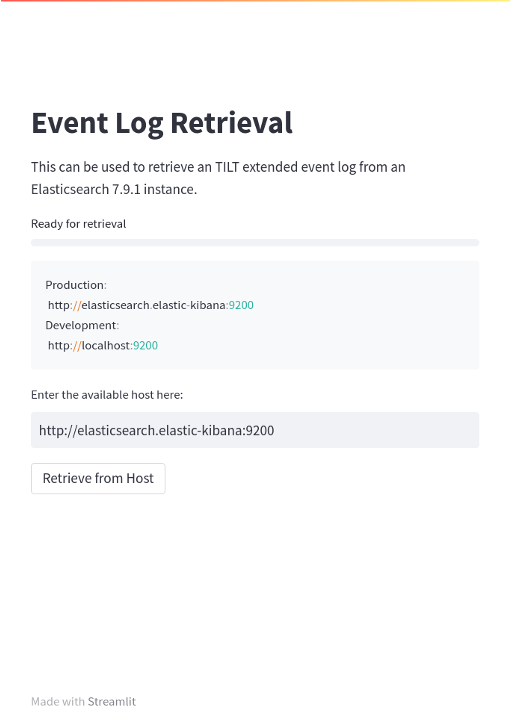
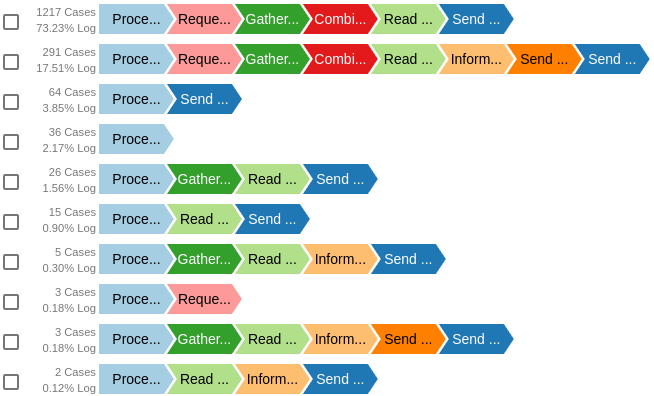
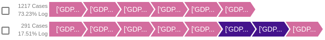
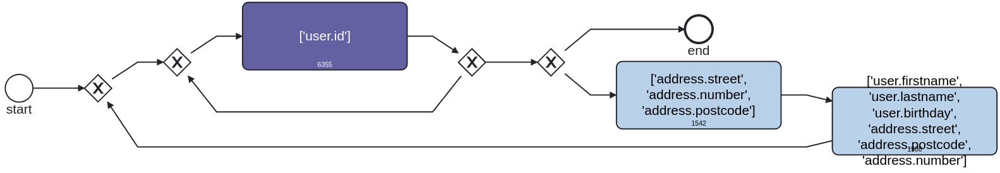
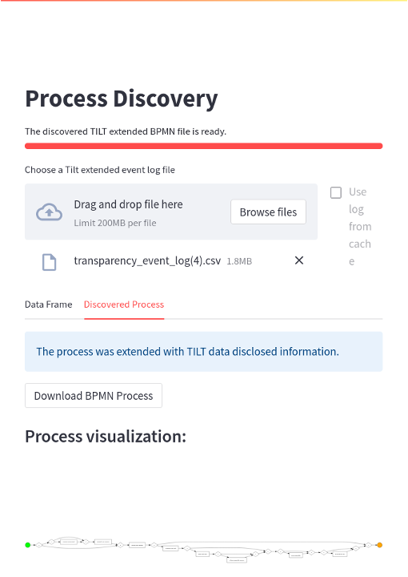
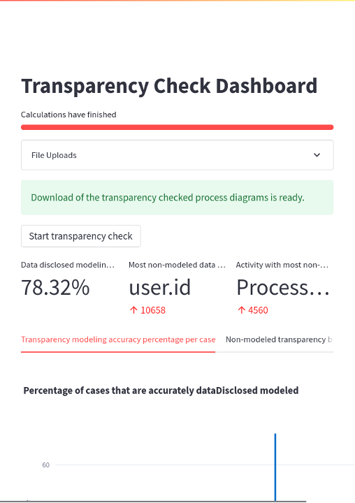

# Transparency conformance checking dashboard

## Event log retrieval
The first page assists the querying of Elasticsearch for transparency-focused event logs.
A data controller can define the location of the Elasticsearch cluster and, through the click of a button, load all found transparency-focused event logs.
As elasticsearch stores logs in JSON, it is required to transform the log into a tablular format, which is also handeled by this page.
A data controller can download that transformed event log for further analysis tasks in process mining tools such as PMtk or using PM4PY.

### Additonal analysis options of the transparency-focused event log
#### Process Variant Expolration

#### Legal Basis Variant Exploration

#### Categories-Oriented Variant Exploration

## Process discovery
The second page assists with the process discovery and transparency extension of the discovered process.
It takes the transparency-focused event log from the first page as an input and creates the discovered transparency extended process model.
The page displays the uploaded event log data frame and discovered process model.
It also allows for downloading the transparency extended process model.

## Transparency checking
The last mini page, assists with the transparency-checking procedure.
It takes a normative process model, the discovered process model, and the transparency-focused event log as input and calculates the abovementioned metrics.
Additionally, it provides the data controller with two tables showing which activities and categories are most often not modeled.
The data controller can download the marked discovered and normative process models through a download button.
These models can be loaded in the Camunda modeler with the plug-in of contribution C1 and can be further evaluated.
